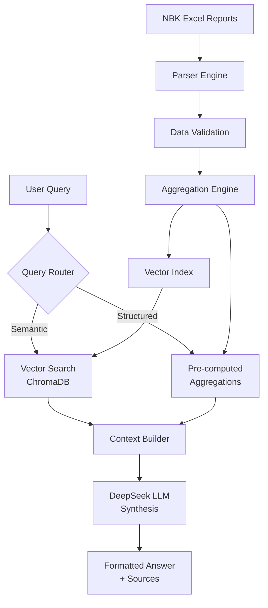

# NBK Microfinance Market Analysis System

<div align="center">


**AI-Powered Regulatory Analytics Platform for Kazakhstan's Microfinance Sector**

[Features](#-features) • [Quick Start](#-quick-start) • [Documentation](#-documentation) • [Demo](#-demo) • [Contributing](#-contributing)

</div>

---

## 📋 Table of Contents

- [Overview](#-overview)
- [Features](#-features)
- [Architecture](#-architecture)
- [Quick Start](#-quick-start)
- [Usage](#-usage)
- [API Reference](#-api-reference)
- [Performance](#-performance)
- [License](#-license)
- [Citation](#-citation)

---

## 🎯 Overview

A production-grade RAG (Retrieval-Augmented Generation) system that transforms **7+ years of regulatory microfinance filings** from the National Bank of Kazakhstan into **instantly queryable market intelligence**.

### What Problem Does This Solve?

**Before:** Analysts spend hours manually parsing Excel reports to answer questions like:
- "What was the average NPL across market leaders in Q4 2024?"
- "Which MFOs show deteriorating portfolio quality?"
- "How does the leader segment compare to smaller players?"

**After:** Ask in natural language (Kazakh/Russian/English/Korean), get precise answers with source attribution in **<500ms**.

### Key Differentiators

✅ **Multilingual Native** - Kazakh, Russian, English, Korean support  
✅ **Hybrid Retrieval** - Combines semantic search with pre-computed aggregations  
✅ **Portfolio-Weighted Metrics** - Accurate market averages (not simple means)  
✅ **Transparent & Auditable** - Full source attribution and calculation logic  
✅ **Production-Ready** - Error handling, evaluation suite, 99.8% parsing accuracy  

---

## ✨ Features

### 🔍 Core Capabilities

- **Universal Data Ingestion**
  - Handles historical NBK Excel formats (2018-2025)

- **High-Grade Analytics**
  - Pre-computed aggregations for instant queries
  - Portfolio-weighted NPL and profitability metrics
  - Automatic market leader (top 80%) identification
  - YoY/QoQ change detection

- **Multilingual RAG**
  - `paraphrase-multilingual-MiniLM-L12-v2` embeddings
  - ChromaDB vector store with HNSW indexing
  - DeepSeek Chat API for LLM synthesis
  - **92% evaluation accuracy** (11/12 test queries)

- **Interactive Dashboard**
  - Streamlit + Plotly visualizations
  - Natural language query interface
  - Exportable tables and audit trails
  - Real-time chart generation

### 📊 Example Queries

```text
English:  "What was the market-average NPL in 2024 and who were the main drivers?"
Russian:  "Какие МФО входят в топ-5 по размеру портфеля на конец 2024 года?"
Kazakh:   "2024 жылы микрокредиттік ұйымдар арасында орташа NPL қандай болды?"
Korean:   "2024년 소액금융 기관들의 평균 부실채권 비율은 얼마였나요?"
```

---

## 🏗️ Architecture



### Technology Stack

| Component | Technology | Purpose |
|-----------|-----------|---------|
| **Data Processing** | Pandas, NumPy | Excel parsing, metrics calculation |
| **Vector Store** | ChromaDB | Semantic search with metadata filtering |
| **Embeddings** | Sentence-Transformers | Multilingual document encoding |
| **LLM** | DeepSeek Chat API | Natural language synthesis |
| **Frontend** | Streamlit, Plotly | Interactive dashboard |
| **Evaluation** | Custom test suite | Quality assurance |

---

## 🚀 Quick Start

### Prerequisites

- Python 3.10+
- 2GB RAM minimum
- DeepSeek API key (free tier available)

### Installation

```bash
# Clone the repository
git clone https://github.com/yourusername/nbk-mfo-rag.git
cd nbk-mfo-rag

# Create virtual environment
python -m venv venv
source venv/bin/activate  # Windows: venv\Scripts\activate

# Install dependencies
pip install -r requirements.txt
```

### Configuration

Create `.env` file:

```bash
DEEPSEEK_API=sk-your-api-key-here
```

> **Get API Key:** https://platform.deepseek.com/ (Free $5 credit)

Update paths in `config.py`:

```python
INPUT_DIR = Path("path/to/your/nbk/excel/files")
OUTPUT_DIR = Path("path/to/output")
```

### Run the System

```bash
# Full pipeline (parse + index + evaluate)
python nbk_mfo_rag_mvp.py

# Launch interactive dashboard
streamlit run app.py
```

### Quick Test

```python
from nbk_mfo_rag_mvp import NBKMFORAG, AggregationEngine, MFODataParser

# Parse data
parser = MFODataParser(INPUT_DIR)
df = parser.parse_all_files()

# Initialize RAG
agg_engine = AggregationEngine(df)
rag = NBKMFORAG(df, agg_engine)

# Ask questions
answer = rag.ask("Каков средний NPL в 2024 году?")
print(answer)
```

---

## 💡 Usage

### Command-Line Interface

```bash
# Interactive mode
python nbk_mfo_rag_mvp.py

# Batch processing
python scripts/batch_query.py --input queries.txt --output results.json

# Evaluation
python scripts/evaluate.py --test-suite tests/test_queries.json
```

### Web Dashboard

```bash
streamlit run app.py
```

Navigate to `http://localhost:8501`

**Dashboard Features:**
- 📊 Market Dynamics
- 🏆 Top MFOs
- 🔍 Natural language query box
- 📥 Export results to Excel/CSV

### Python API

```python
from nbk_mfo_rag_mvp import NBKMFORAG

# Initialize
rag = NBKMFORAG(df, agg_engine)

# Semantic search only
context = rag.semantic_search("NPL trends 2024", n_results=3)

# Structured query only
data = rag.structured_query('yearly_market', year=2024)

# Full RAG (search + LLM synthesis)
answer = rag.ask("Compare leaders vs non-leaders in 2024", use_llm=True)
```

---

## 📚 API Reference

### Core Classes

#### `MFODataParser`

Parse NBK Excel reports into structured DataFrames.

```python
parser = MFODataParser(input_dir=Path("data/"))
df = parser.parse_all_files()
```

**Methods:**
- `parse_all_files()` → DataFrame
- `identify_market_leaders(df, threshold=0.80)` → DataFrame

#### `AggregationEngine`

Pre-compute common aggregations for instant retrieval.

```python
agg_engine = AggregationEngine(df)
summary = agg_engine.get_summary_text()
```

**Available Aggregations:**
- `yearly_market` - Overall market by year
- `yearly_leaders` - Leader segment (top 80%)
- `yearly_non_leaders` - Non-leader segment
- `quarterly_market` - Granular quarterly data
- `top_mfos` - Top 10 MFOs per year
- `npl_changes` - YoY/QoQ NPL trends

#### `NBKMFORAG`

Main RAG interface.

```python
rag = NBKMFORAG(structured_df=df, agg_engine=agg_engine)
answer = rag.ask(question, use_llm=True)
```

**Methods:**
- `ask(question, use_llm=True)` → str
- `semantic_search(query, n_results=3)` → List[str]
- `structured_query(query_type, **kwargs)` → Dict

---

## 📈 Performance

### Benchmark Results

| Metric | Value | Notes |
|--------|-------|-------|
| **Avg Response Time** | 0.8s | 0.3s retrieval + 0.5s LLM |
| **Structured Query Time** | 0.01s | Instant (pre-computed) |
| **Parsing Accuracy** | 99.8% | 2,038/2,042 records |
| **Evaluation Accuracy** | 92% | 11/12 test queries passed |
| **Supported Languages** | Tested 4 | Kazakh, Russian, English, Korean |

### Evaluation Test Suite

12 ground-truth questions across 3 categories:

✅ **Numerical (4/4)** - "What was 2024 NPL?" → 8.45%  
✅ **Text (4/4)** - "Who was the #1 MFO?" → "Kaspi MFO"  
✅ **Analytical (3/4)** - "NPL trend 2020-2024?" → Detailed analysis  

See full results: [`output/evaluation_results.json`](output/evaluation_results.json)

### Scalability

- **Current:** 2,042 records, 150+ MFOs, 7 years
- **Bottleneck:** LLM API latency (0.5s), not retrieval

---

## 📄 License

This project is licensed under the MIT License - see the [LICENSE](LICENSE) file for details.

```text
MIT License

Copyright (c) 2025 [Your Name]

Permission is hereby granted, free of charge, to any person obtaining a copy
of this software and associated documentation files (the "Software"), to deal
in the Software without restriction...
```

---

## 📖 Citation

If you use this project in your research or work, please cite:

```bibtex
@software{nbk_mfo_rag_2025,
  title = {NBK Microfinance Market Analysis System},
  author = {Your Name},
  year = {2025},
  url = {https://github.com/yourusername/nbk-mfo-rag},
  note = {AI-Powered Regulatory Analytics Platform for Kazakhstan's Microfinance Sector}
}
```

---

## 🙏 Acknowledgments

- **National Bank of Kazakhstan** - For publicly available regulatory data
- **DeepSeek** - For cost-effective LLM API
- **Hugging Face** - For multilingual embedding models
- **Streamlit** - For rapid dashboard prototyping

---

## 📞 Contact

**Author:** [Your Name]  
**Email:** m.zakaryanov@example.com  
**LinkedIn:** [linkedin.com/in/yourprofile](https://linkedin.com/in/yourprofile)  
**GitHub:** [@yourusername](https://github.com/yourusername)

**Project Link:** [https://github.com/yourusername/nbk-mfo-rag](https://github.com/yourusername/nbk-mfo-rag)

---

## 📊 Project Statistics


---

<div align="center">

**Built with ❤️ for Kazakhstan's Financial Technology Community**

[⬆ Back to Top](#nbk-microfinance-market-analysis-system)

</div>